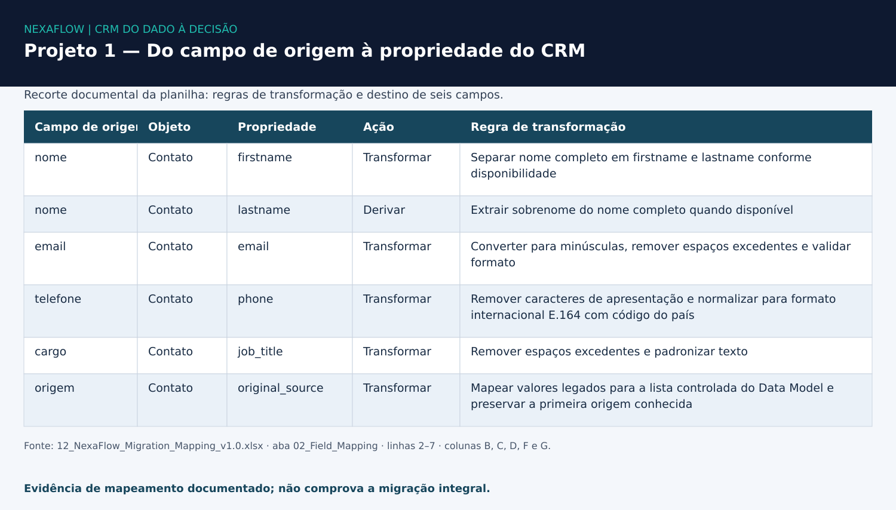

# NexaFlow — CRM do dado à decisão
## Projeto 1 · Arquitetura e migração de CRM

**Concluído em 21/09/2026:** pacote de migração preparado e piloto representativo executado no HubSpot.

## Problema

As informações comerciais estavam distribuídas entre 14 fontes, com duplicidades, formatos inconsistentes e vínculos frágeis entre registros. Antes de importar os dados, era necessário definir identidade, destino dos campos, associações e critérios de elegibilidade.

## Minha contribuição

Participei do diagnóstico das fontes, da revisão das regras de preparação e mapeamento e da validação dos resultados do piloto. Também organizei as decisões, exceções e evidências para que a entrega pudesse ser conferida. O case contou com apoio de IA na análise, implementação técnica, documentação e QA.

## Trabalho realizado

- Inventário e auditoria das fontes; definição de objetos, relacionamentos, propriedades e governança.
- Mapeamento de origem para destino, regras de identidade e ordem de carga.
- Preparação dos dados com Power Query e validações SQL, preservando exceções rastreáveis.
- Piloto no HubSpot e conferência de registros, associações e diferenças entre origem e destino.

## Resultados

| Entrega | Resultado documentado |
|---|---|
| Fontes avaliadas | 14 |
| Registros consolidados | 341 |
| Registros elegíveis | 177 |
| Exceções ou pendências de dados | 164 |
| Registros criados no piloto | 9, incluindo 2 Contacts |

Os 177 registros elegíveis compõem o pacote preparado; a migração integral não foi executada. Os 9 registros criados incluem dois contatos no cenário de uma nota e não equivalem a nove linhas distintas de origem.

O pacote deste projeto contém 15 Deals elegíveis. A análise do Projeto 3 usa uma amostra separada de 5 Deals; são escopos diferentes.

## Evidências

A visualização reproduz valores selecionados da aba **02_Field_Mapping**, linhas **2–7**, colunas **B, C, D, F e G**. Ela mostra regras documentadas de transformação e destino; não é uma captura do HubSpot nem prova de migração integral.

- [Relatório final: piloto, reconciliação e limites](./evidence/15_NexaFlow_Data_Migration_Report_v1.0.docx)
- [Modelo de dados e governança](./evidence/08_Data_Model_and_Governance_NexaFlow.xlsx)
- [Planilha de mapeamento que sustenta a visualização](./evidence/12_NexaFlow_Migration_Mapping_v1.0.xlsx)

## Aprendizados e competências

A entrega demonstra diagnóstico de dados, modelagem de CRM, mapeamento, preparação e reconciliação. O principal aprendizado foi separar dados preparados de dados efetivamente importados e conferir associações e valores no destino.

A empresa e os dados são fictícios. Associações financeiras em lote por API e rollback transacional não foram demonstrados; os arquivos brutos e o pacote completo de importação não fazem parte desta seleção pública.

[← Apresentação do case](../README.md) · [Próxima etapa: operação e automações →](../02-lifecycle-pipeline-automation/)
