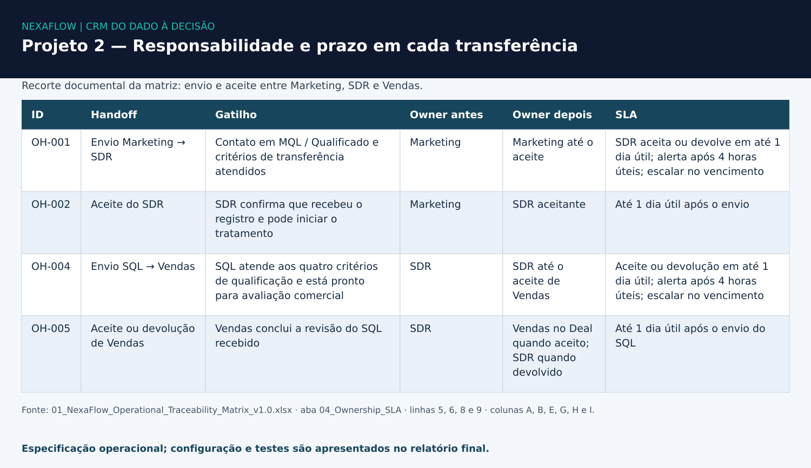

# Projeto 2 · Operação Comercial e Automações

**Status:** Concluído em 02/10/2026  
Regras operacionais definidas, workflows testados e desvios documentados.

---

## Problema

A passagem de leads entre Marketing, SDR e Vendas não tinha critérios claros de qualificação, ownership e prazos.

Também faltavam controles de próxima ação, regras de perda e um handoff estruturado para o onboarding.

---

## O que foi feito

- Definição de lifecycle, critérios de entrada/saída e pipeline
- Especificação de responsabilidades, SLAs e transferências entre equipes
- Configuração e teste de tarefas, alertas e monitoramento no HubSpot
- Validação de campos condicionais e motivos de perda
- Testes de cenários de confirmação financeira e handoff para onboarding

---

## Resultados

| Frente | Resultado documentado |
|--------|-----------------------|
| Desenho operacional | 8 transições e 60 itens de rastreabilidade |
| Primeiro contato (WF-003) | Delay de 1 dia útil + tarefa atribuída ao owner |
| Monitoramento (WF-004) | Negócio sem próxima atividade gerou tarefa de verificação |
| Alerta (WF-002) | Alerta após 4 horas corridas (horas úteis não disponíveis no ambiente testado) |
| Controle de estágio | Campos condicionais e motivo de perda testados |
| Financeiro e onboarding | Cenários PAID e PENDING validados (handoff manual) |

> O aceite entre equipes permaneceu **manual**.  
> Nos testes realizados, os workflows **não alteraram automaticamente** owner, Lead Status ou Deal Stage.

---

## Automatizado × manual

| Frente | O que a automação executou nos testes | O que permaneceu manual |
|---|---|---|
| Primeiro contato — WF-003 | Delay de 1 dia útil e criação de tarefa atribuída ao owner | Realizar o contato e registrar seu resultado |
| Monitoramento — WF-004 | Criação de tarefa de verificação para negócio sem próxima atividade informada | Conferir a timeline e tratar a pendência |
| Alerta de SLA — WF-002 | Envio de alerta após 4 horas corridas | Aceitar ou devolver o handoff e executar a transferência |
| Financeiro e onboarding | Não foi demonstrada integração financeira automática | Validar o cenário sintético, registrar Closed Won e realizar o handoff para onboarding |

Os cenários PAID/PENDING são simulações; não comprovam pagamentos reais. A criação de uma tarefa não comprova sua execução pela equipe.

---

## Evidências

Recorte da aba **04_Ownership_SLA**, linhas 5, 6, 8 e 9. A imagem mostra a **regra especificada**, incluindo alerta em horas úteis; o WF-002 executou **4 horas corridas** no ambiente testado. A troca de responsável representada no desenho dependia de aceite e tratamento manual.

- [Relatório final de configurações, testes e desvios](./evidence/03_NexaFlow_Lifecycle_Pipeline_Automation_Report.docx)
- [Matriz operacional de rastreabilidade](./evidence/01_NexaFlow_Operational_Traceability_Matrix_v1.0.xlsx)

---

## Principais aprendizados

- **SLA:** conferir a unidade de tempo realmente disponível; o alerta de 4 horas corridas não equivale ao desenho de 4 horas úteis.
- **Ownership:** selecionar o owner no modal não persistiu em um teste. A atribuição direta no Deal foi o procedimento observado; é necessário conferir o valor salvo.
- **Próxima ação:** campos de controle preenchidos não comprovam atividade executada. A timeline precisa ser conferida, e a responsabilidade deve ser preservada até o aceite do handoff.

---

**Ferramentas utilizadas:** HubSpot · Excel.

[← Etapa anterior: Arquitetura e Migração](../01-crm-architecture-data-migration/) · [Voltar para a apresentação do case](../README.md) · [Próxima etapa: Relatórios e Análise →](../03-revenue-reporting-operations-analytics/)
