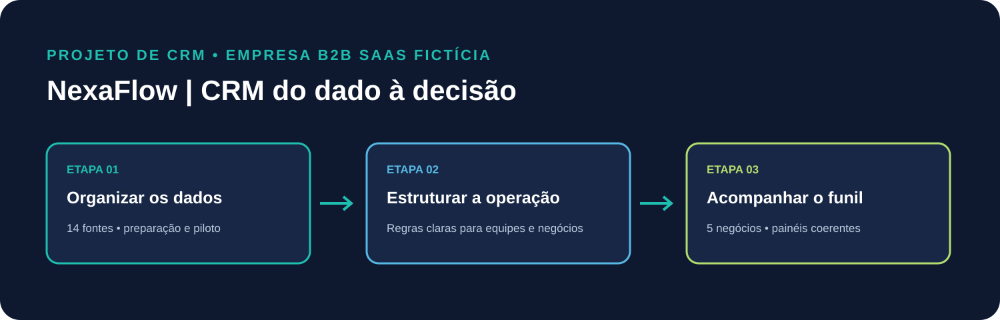
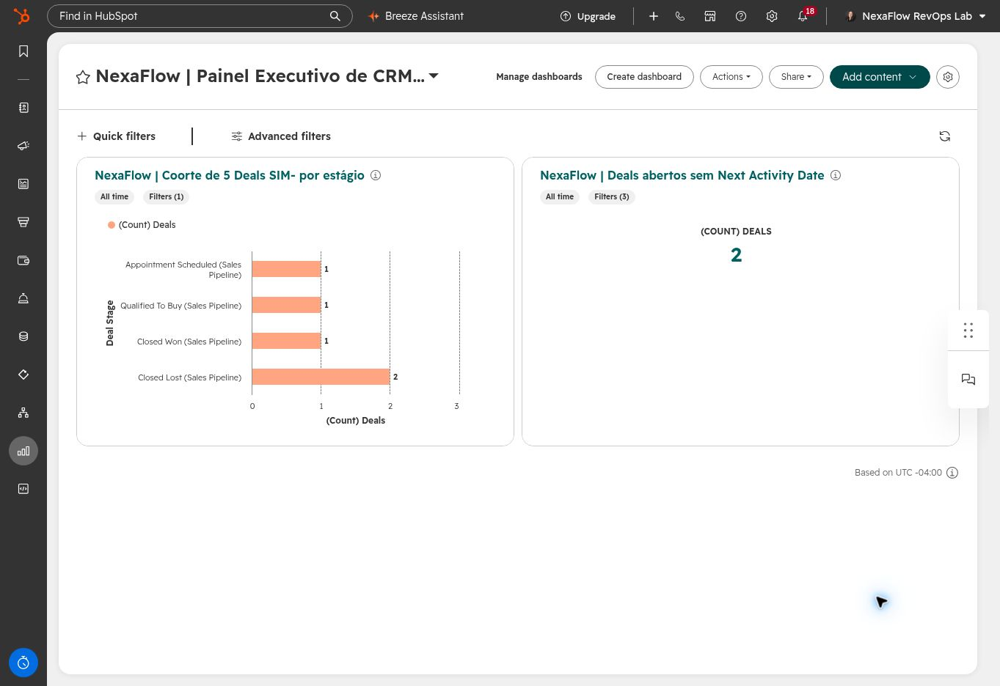
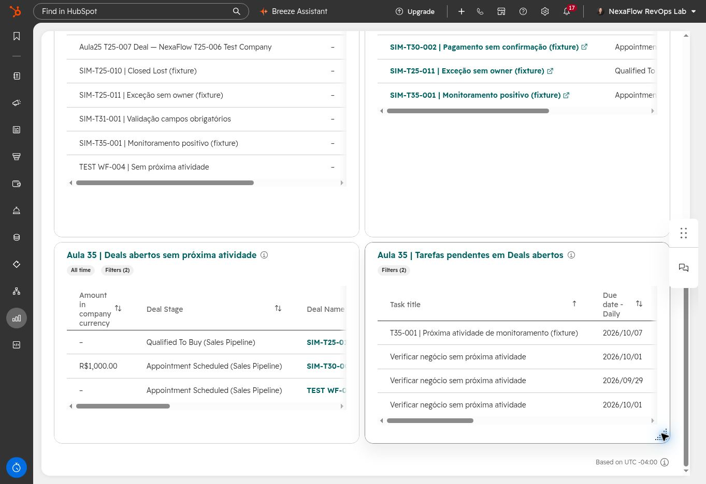

<div align="center">

# NexaFlow_CRM_Implementation

### NexaFlow | CRM do dado à decisão

Case de CRM Operations & HubSpot • B2B SaaS fictício • Portfólio independente

[LinkedIn profissional](https://www.linkedin.com/in/karla-teshima-revops) · [Apresentação completa (PDF)](./assets/NexaFlow_Apresentacao_de_Projeto_Portfolio.pdf)


</div>



## Visão do case

A NexaFlow é uma empresa **fictícia** B2B SaaS usada para aplicar conceitos de CRM Operations e Revenue Operations em ambiente de treinamento. O portfólio acompanha a jornada do diagnóstico de dados à operação comercial e à análise executiva.

> Este é um case independente de treinamento, não um projeto para cliente nem uma implantação em produção. Os registros analíticos são fixtures sintéticas.

## Projetos

| Projeto | Problema trabalhado | Execução e resultado documentado |
|---|---|---|
| [01 — CRM Architecture & Data Migration](./01-crm-architecture-data-migration/) | Dados dispersos, inconsistências e relações sem rastreabilidade | Auditoria de 14 fontes; 341 registros consolidados, 177 elegíveis e 164 exceções/pendências; piloto HubSpot de 9 registros selecionados. O piloto não representa carga integral. |
| [02 — Lifecycle, Pipeline & Automation](./02-lifecycle-pipeline-automation/) | Critérios comerciais, ownership, SLAs e handoffs pouco consistentes | Regras e workflows implementados/testados em ambiente de treinamento; resultados, passos manuais e desvios documentados. |
| [03 — Revenue Reporting & Operations Analytics](./03-revenue-reporting-operations-analytics/) | Necessidade de métricas e dashboards reconciliados | Coorte explícita de 5 Deals alinhada entre CSV, SQLite, SQL e dashboards; lote controlado CSV → SQLite, sem API ou sincronização. |

## Destaques do Projeto 3

A mesma coorte de **5 Deals sintéticos** fundamenta SQL, planilha de resultados e dashboards HubSpot:

- Appointment Scheduled: 1
- Qualified To Buy: 1
- Closed Won: 1
- Closed Lost: 2
- QRY-003 encontrou 2 Deals abertos sem Next Activity Date informado e nenhum sem owner.

O campo vazio não prova ausência de tarefa. `Amount` do Deal não prova pagamento nem receita reconhecida. QRY-005/006 não foram executadas porque faltam os exports necessários.

Os **15 Deals elegíveis** do pacote de migração do Projeto 1 pertencem ao universo preparado para aquele piloto. Eles não são a população analítica do Projeto 3, cuja coorte verificada tem **5 Deals**.

### Dashboards HubSpot

**Executivo** — distribuição dos 5 Deals por estágio.



**Operacional** — Deals abertos sem Next Activity Date informado.



## Capacidades demonstradas

- CRM data architecture, data audit e governança;
- source-to-target mapping, ETL/Power Query e qualidade de dados;
- desenho de lifecycle, pipeline, ownership, SLA e handoffs;
- configuração e testes de workflows no HubSpot;
- SQL aplicado a funil, qualidade e reconciliação;
- HubSpot reporting, análise operacional e comunicação executiva;
- QA, registro de limites e documentação orientada a evidências.

## Aprendizados do case

- **Preparação não é migração integral:** o Projeto 1 separa universo elegível, exceções e piloto realmente executado.
- **Configuração precisa de validação:** no Projeto 2, persistência do owner e comportamento de workflows foram conferidos em testes; etapas manuais e desvios ficaram registrados.
- **Campo vazio não prova ausência de atividade:** `Next Activity Date` precisa ser interpretado junto à timeline e ao contexto operacional.
- **Valor do Deal não é receita reconhecida:** `Amount` sozinho não comprova pagamento ou reconhecimento contábil.
- **Métrica depende de uma população definida:** a coorte de 5 do Projeto 3 foi reconciliada entre CSV, SQLite, SQL e dashboards.

## Limites de interpretação

- NexaFlow e registros CRM são fictícios; os dados analíticos são fixtures sintéticas.
- Projeto 1: pacote de migração preparado e piloto representativo; não houve carga integral dos 177 elegíveis.
- Projeto 2: cenários financeiros e de onboarding são simulados/manuais quando indicado; sem transação ou automação financeira de produção.
- Projeto 3: integração de lote manual CSV → SQLite, sem API, sincronização contínua ou escrita de volta no HubSpot.
- Deal Amount não comprova pagamento nem receita reconhecida.
- Capturas e relatórios demonstram um ambiente de treinamento; não representam resultados de uma empresa real.
- Não há vídeo no portfólio; a apresentação usa documentos e capturas de tela.

## Estrutura do repositório

```text
NexaFlow_CRM_Implementation/
├── 01-crm-architecture-data-migration/
├── 02-lifecycle-pipeline-automation/
├── 03-revenue-reporting-operations-analytics/
├── assets/
└── README.md
```

## Navegação

Comece pelo [PDF de apresentação](./assets/NexaFlow_Apresentacao_de_Projeto_Portfolio.pdf) e depois abra o README de cada projeto. Os documentos publicados são evidências selecionadas; bases brutas e arquivos técnicos de execução não fazem parte deste repositório público.

---

<div align="center">

**Karla Teshima**  
[LinkedIn profissional](https://www.linkedin.com/in/karla-teshima-revops)

</div>
